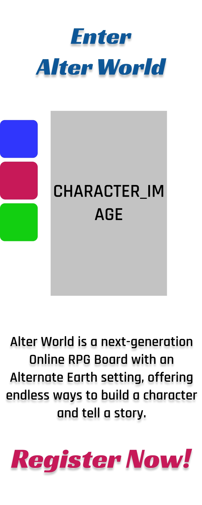
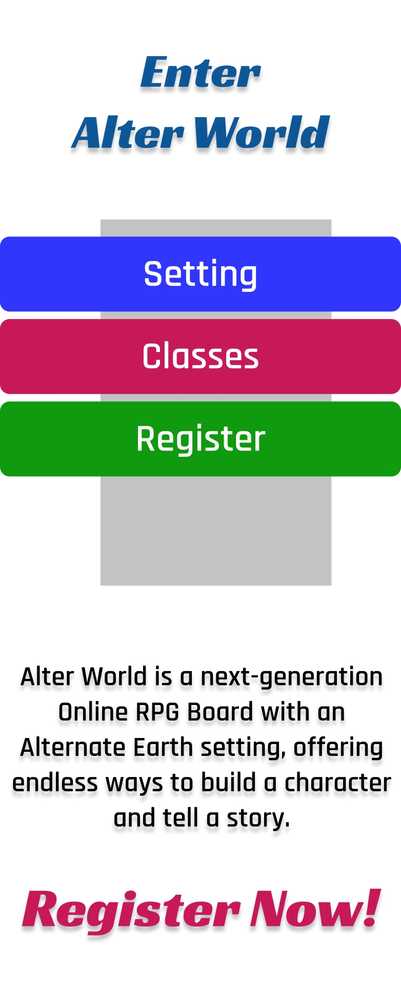
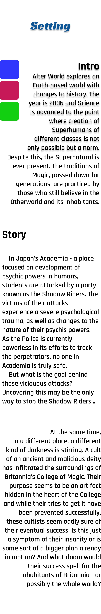
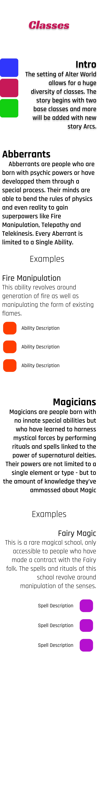
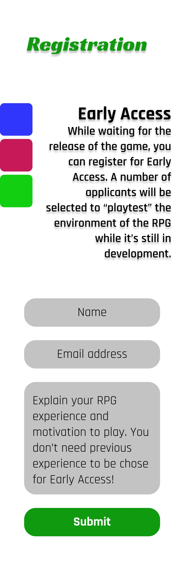
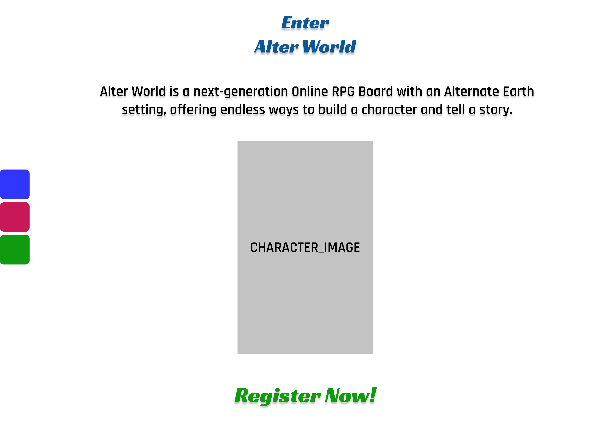
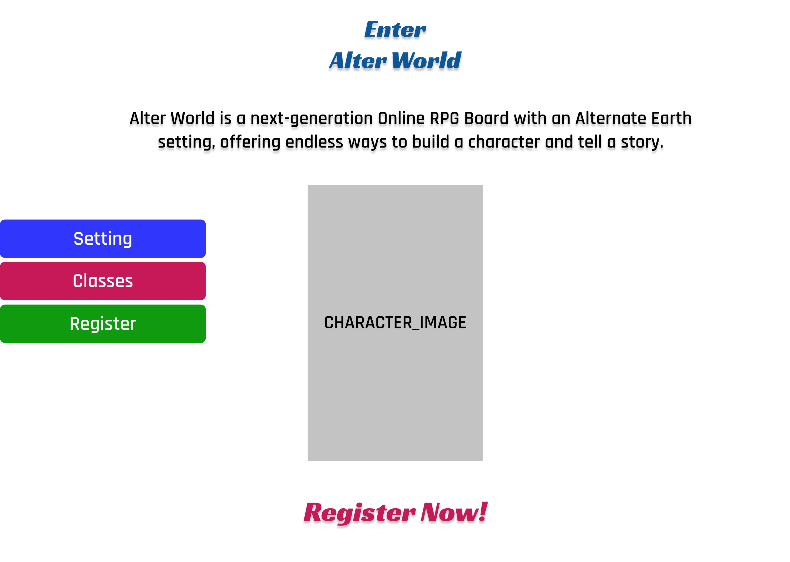
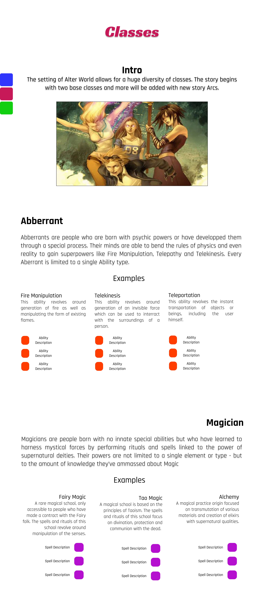
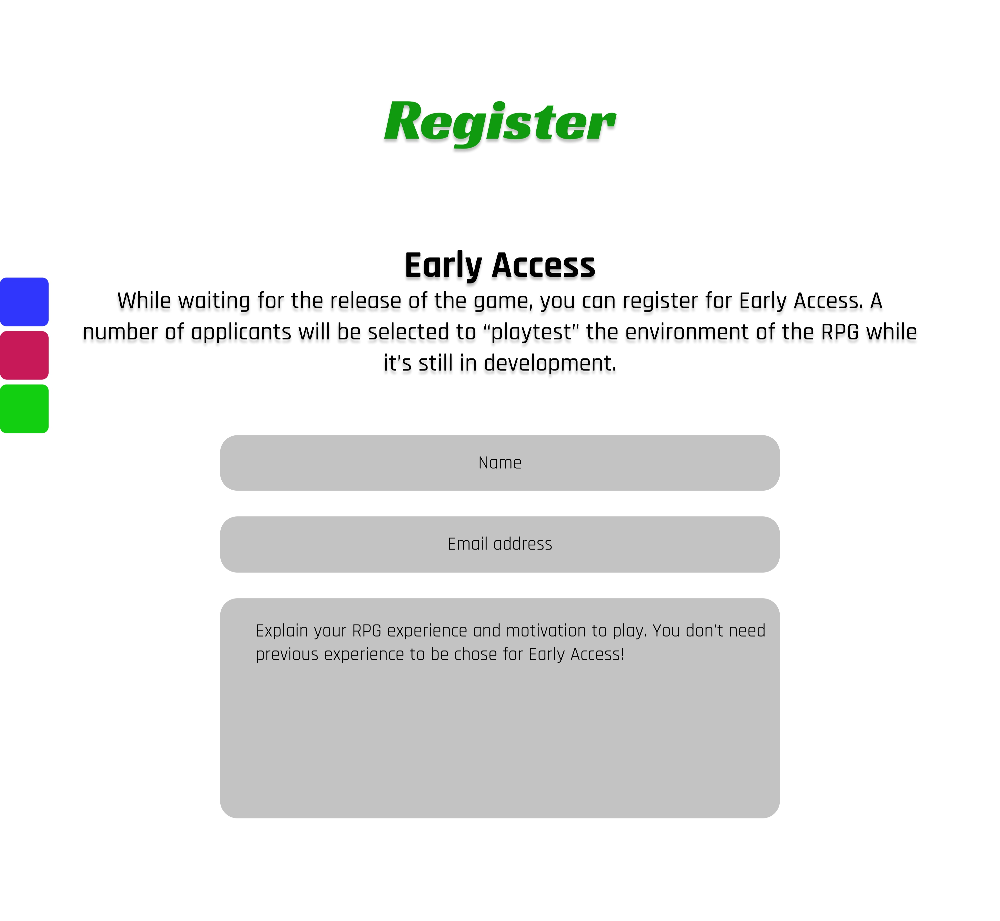

## 1.1.1 Background

This project is aimed at advertising and
popularizing my upcoming forum-based
Role-Playing Game(RPG) called "Alter World".

One of the main reasons the project needs 
such a "promo" of sorts is that, unless a
person is already familiar with the concept of forum
Role-Playing Games, they would not understand
that what they're visiting is a actually a
"game", if they stumble on the website by chance. If
they do however see this promo before delving into
the phpBB forum jungle, it's much more likely that
they will _see_ the *game* part in the forum.

The second reason is _presentation_. Whenever I try
to hook people in my game, as I'm trying to expand the
player base, I have to go through an explanation
of the world, mechanics and systems - and even if I
can do that in simple terms, it's still saves much
more time to have people look through the promo
website and then just answer their further questions
if they have any. Not just that, but one important
consideration is that the human brain works with
visual presentations better than with vocal or
written ones. Having the colors and images speak to
them really improves the chance that they will
_understand_ the world I'm trying to present to them.

The third reason is of course advertisement - the
easiest way find people interested in your project
is to promote yourself openly to them. This promo
would serve well not just as a presentation in the
game forum itself, but as something that people are
directed to by clicking ad banners or simply finding
it in a search engine through good Search Engine
Optimisation.

## 1.1.2 Wireframes

This is a list of the low-fidelity wireframes
for each page.

###Mobile

_(Landing page)_

_(Landing page with open menu)_

_(Setting Page)_

_(Classes Page)_

_(Registration Page)_

###Desktop

_(Landing page)_

_(Landing page with open menu)_

_(Setting Page)_

_(Classes Page)_

_(Registration Page)_

## 1.1.3 Colour Choices

The colour scheme of the website is based on three
main colours - Blue(3137FD), Red(C81A58) and 
Green(119A11), the ones used in the menu options.
This colour scheme is followed also by the images
used in the website.

The intentions behind the color choice is to create
a feeling of diversity in the world presented by the
game, while their dark shades hint the dark
undertones of the world followed by the in-game
story.

##1.1.4 Accessibility

##1.1.5 GDPR

While the Early Access sign-up form does not
actually handle requests currently, when the
registration process opens up, the only data
saved on the server will be the one provided in the
form. The only time their would be contacted
through their email address is when the game
launches, after which all details recorded would be
erased from the server, unless the users have
opted in to receive news and updates regarding
the state of the game.

The users can always contact the project
administrator and ask for their details to be
erased from the records before that point. They can
also always contact the project managers to
download their data record.

##1.2.6 Distance Selling

The projects does not offer distance selling
services of any kind.

##1.2.7 Evaluation

The problem that started this project is
now solved near-completely. The website serves
as both a good presentation of the Role-Playing
Game and as a way to advertise it. There are still
things left to be done in the future - like a news
page, or the addition of more classes to the
presentation, but those are all things that will
come as the game actually starts running and
develops over time.

The problems encountered during the development of
the website were few and far between. The biggest
one was coming up with a sidebar menu that would
work on both mobile and desktop versions as I
really wanted to avoid using the Sandwich design.
In the end I just settled for creating two separate
javascript functionalities. On mobile, the menu
opens up _by clicking_ the minified sidebar,
also including a _close_ button. On Desktop, the
menu opens up when the minified sidebar is _hovered
over_. 

The website was tested for different resolutions
using Google Chrome's developer tools. After some
testing and research on the web, I figured that
the best way to go about making the design
responsive is just to opt in for the largest
mobile resolution possible as that would include
all the smaller ones. Anything wider than 480px uses
the Desktop version of the website.

##2. Implementation

##2.1.1 Development
The problem of this project was solved using only
four web pages. They are all inter-linked, with the
exception of the landing page - while it does lead
to the other three pages, those three pages don't
lead to the landing page. This is done by a choice,
as it's a design commonly used by video game
websites nowadays, like the one of League of
Legends. The landing page in this kind of design
has no other purpose but to grab just enough of the
user's attention. 

##2.2.1 Responsive Design

As is the requirement for any web project nowadays,
the design for this website is completely
responsive. The implementation followed
mobile-first approach with the reasoning that
it's easy to grow a design for big screens, but
it's much more difficult to downgrade design for
smaller ones. The results were very good, as in the
end only a few changes were required to translate
the website properly from mobile to desktop.

##2.3.1 Use of JavaScript

The website uses JavaScript at a few, but key
places.

The first one is the sidebar menu. There's
actually two separate implementations here - one
for mobile and one for desktop. On mobile the menu
is opened by using a _onclick_ handler and on
desktop by using _onmouseenter_.

The second use of JavaScript is in the Early Access
registration form. Here the functionality is much
simpler - when a user tries to submit the form, a
_onclick_ script applied to the Submit button
validates that all fields are filled. Something
that needs to be noted here is that the Submit
button is put outside of the form to prevent
form submission as there is no real server behind
the form action, which causes the input fields
to be reset if the submit button is clicked as an
actual part of the form.

##2.4.1
This project can be found on GitHub following this
address: 
https://github.com/ymarkoff/web_technologies_project

It's also hosted on the World Wide Web: http://alter-world.online/promo
